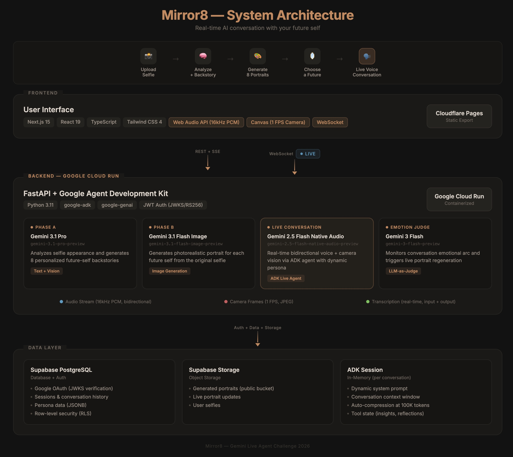

# Mirror8 — Meet Your Future Self

Real-time AI conversation with your future self. Upload a selfie, AI generates 8 future-self portraits, pick one, then have a live voice+video conversation where your future self can see you, hear you, and speak to you.

Powered by **Gemini** (text analysis, image generation, real-time voice) via Google ADK, with **Supabase** for auth and persistence.

## User Flow

```
Landing → Sign in with Google → Upload Selfie → AI generates 8 futures → Pick one → Live voice conversation
```

## Architecture



**4 Gemini models** work in a coordinated pipeline:

| Phase | Model | Purpose |
|-------|-------|---------|
| **A — Analysis** | Gemini 3.1 Pro | Selfie analysis + 8 personalized backstories |
| **B — Portraits** | Gemini 3.1 Flash Image | Photorealistic portrait for each future self |
| **Live Conversation** | Gemini 2.5 Flash Native Audio (ADK) | Real-time bidirectional voice + camera vision |
| **Emotion Judge** | Gemini 3 Flash | Monitors emotional arc, triggers live portrait regeneration |

Each conversation creates a unique **ADK Agent** with a dynamic system prompt built from the archetype + selfie analysis + user context. The future self can see the user through the camera (1 FPS), hear them (16kHz PCM audio), and respond in character with a gender-matched voice.

During the conversation, the portrait **evolves in real time** — a separate Gemini model evaluates the emotional arc and regenerates the portrait at meaningful moments (breakthroughs, fears, dreams).

## Tech Stack

| Layer | Technology |
|-------|-----------|
| **Frontend** | Next.js 15 (static export), React 19, TypeScript, Tailwind CSS v4 |
| **Backend** | Python FastAPI, Google ADK, google-genai SDK |
| **Auth** | Supabase Auth (Google OAuth), JWKS/RS256 JWT verification |
| **Database** | Supabase PostgreSQL (sessions, futures tables with RLS) |
| **Storage** | Supabase Storage (portrait images, public bucket) |
| **AI — Analysis** | Gemini 3.1 Pro Preview (selfie → appearance + backstories) |
| **AI — Portraits** | Gemini 2.5 Flash Image (selfie + prompt → portrait) |
| **AI — Live Voice** | Gemini 2.5 Flash Native Audio via ADK (real-time conversation) |
| **Frontend Hosting** | Cloudflare Pages |
| **Backend Hosting** | Google Cloud Run |

## The 8 Futures

| Archetype | Title | Voice |
|-----------|-------|-------|
| The Visionary | Tech Pioneer & Founder | Kore |
| The Healer | Doctor & Humanitarian | Puck |
| The Artist | Creative Director & Storyteller | Charon |
| The Explorer | Adventurer & Travel Writer | Orus |
| The Sage | Professor & Philosopher | Aoede |
| The Guardian | Community Leader & Parent | Fenrir |
| The Maverick | Entrepreneur & Disruptor | Leda |
| The Mystic | Mindfulness Teacher & Writer | Kore |

## Quick Start

### Backend

```bash
cd backend
python -m venv .venv && source .venv/bin/activate
pip install -r requirements.txt
cp .env.example .env  # Add your GOOGLE_API_KEY + Supabase keys
uvicorn app.main:app --reload --port 8080
```

### Frontend

```bash
cd frontend
npm install
npm run dev
```

Open http://localhost:3000

### Environment Variables

**Frontend** (`.env.local` / Cloudflare Pages):
```
NEXT_PUBLIC_API_URL=http://localhost:8080
NEXT_PUBLIC_WS_URL=ws://localhost:8080
NEXT_PUBLIC_SUPABASE_URL=https://xxx.supabase.co
NEXT_PUBLIC_SUPABASE_PUBLISHABLE_KEY=sb_publishable_...
```

**Backend** (`.env` / Cloud Run):
```
GOOGLE_API_KEY=...
SUPABASE_URL=https://xxx.supabase.co
SUPABASE_SECRET_KEY=sb_secret_...
```

## Deployment

```bash
# Backend → Cloud Run
./infra/deploy.sh backend

# Frontend → Cloudflare Pages (auto-deploys on git push)
git push
```

## Known Issues & Fixes

### `nonlocal` required for nested async closures (fixed in revision 00032)

The `audio_suppressed` flag in `mirror_websocket` is read and written inside the nested `downstream_task` function. Python treats any variable assigned with `=` inside a nested function as local to that function — even if it's defined in an enclosing scope. This means reading it *before* the first local assignment raises `UnboundLocalError`. The fix is `nonlocal audio_suppressed` at the top of the nested function.

Other closure variables like `pending_agent_text` didn't hit this because they use `.append()` / `.clear()` (mutation, not reassignment).

---

Built for the Gemini Live Agent Challenge.
